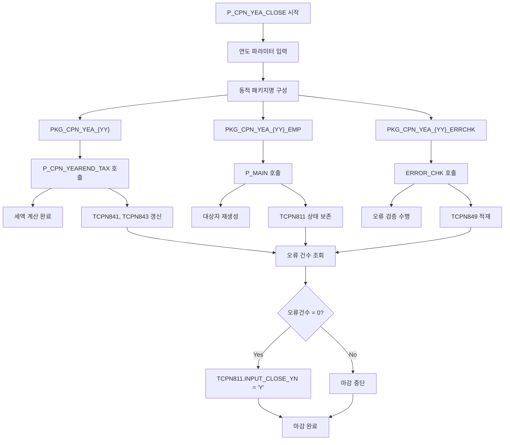
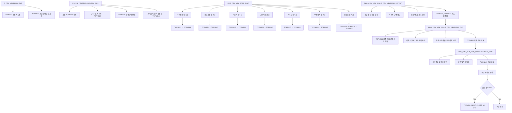
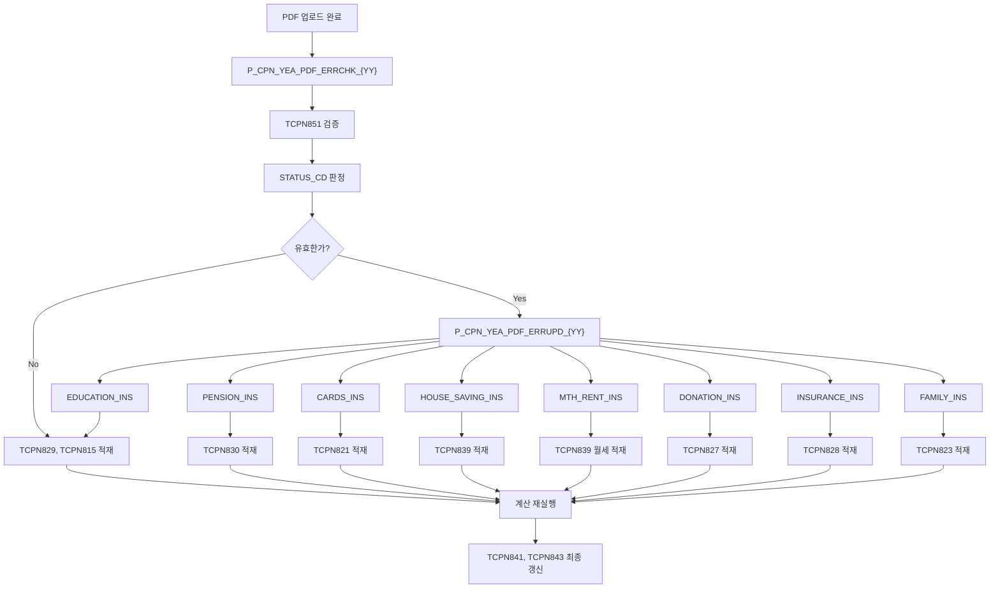

# yjungsan 마감 체인

연말정산 마감 버튼은 단순히 `TCPN811.INPUT_CLOSE_YN='Y'` 로 바꾸는 것이 아니다.
`P_CPN_YEA_CLOSE` 프로시저가 동적 SQL 로 연도별 패키지를 순차 호출하고, `TCPN849`
오류 검증을 통과해야만 상태 전이를 수행한다.

출처: 분석 문서 `EHR_HR50/docs/records/연말정산_yjungsan_소스_DB_상세분석_20260423.md` §7.3~§7.10, §8.

---

## 전체 개요

화면 `마감` 버튼 → `P_CPN_YEA_CLOSE(WORK_YY, ENTER_CD, SABUN, ADJUST_TYPE)` 호출.
이 프로시저는 다음 4가지를 수행한다:

1. 세액 재계산: `PKG_CPN_YEA_{YY}.P_CPN_YEAREND_TAX` 호출로 `TCPN841`, `TCPN843` 완성
2. 대상자 재생성: `PKG_CPN_YEA_{YY}_EMP.P_MAIN` 호출로 `TCPN811`, `TCPN843` 재구성
3. 오류 검증 실행: `PKG_CPN_YEA_{YY}_ERRCHK.ERROR_CHK` 호출로 `TCPN849` 적재
4. 마감 상태 전이: `TCPN849` 오류 건수 조회. 0 건일 때만 `TCPN811.INPUT_CLOSE_YN='Y'` UPDATE

마감 버튼 클릭 후 이 4단계를 모두 통과해야만 실제 상태가 변경된다.

---

## P_CPN_YEA_CLOSE 내부 체인

`P_CPN_YEA_CLOSE`는 동적 SQL 을 사용해 연도별 패키지를 순차적으로 호출한다.



### 단계별 실행 상세

**1단계: `PKG_CPN_YEA_{YY}.P_CPN_YEAREND_TAX` 호출**

- 역할: 연말정산 세액 계산의 최종 엔진
- 호출 대상: 현재 연도의 동적 패키지명 구성
- 실패 시: 세액 재계산 안 됨. `TCPN841` 구식 값 유지로 결과 오류 발생
- 처리 내용:
  - `TCPN843` 원천자료 기초 합산
  - 공제/세액 산식 전개
  - `TCPN841`에 최종 결과 기록

**2단계: `PKG_CPN_YEA_{YY}_EMP.P_MAIN` 호출**

- 역할: 연말정산 대상자 재생성 및 재계산 관리
- 호출 대상: 마감 대상 정산구분의 동적 패키지
- 실패 시: 대상자 결과상세 미갱신. `TCPN843` 기존 값 유지로 불일치 발생
- 처리 내용:
  - `TCPN811`, `TCPN813`, `TCPN815` 등 재구성
  - 종전/주현 자료 복제 및 재설정
  - 재계산 후 `FINAL_CLOSE_YN` 상태 보존

**3단계: `PKG_CPN_YEA_{YY}_ERRCHK.ERROR_CHK` 호출**

- 역할: 계산 결과 품질 검증 게이트
- 호출 대상: 마감 정산구분의 동적 오류검증 패키지
- 실패 시: 오류 검증 미실행. `TCPN849` 공란 상태로 게이트 기능 상실
- 처리 내용:
  - `TCPN811`, `TCPN813`, `TCPN815`, `TCPN817`, `TCPN818`, `TCPN843` 검증
  - 가족/원천자료 대조 및 유효성 점검
  - 오류 한 건씩 `TCPN849`에 적재

**4단계: `TCPN849` 오류 건수 확인 및 상태 전이**

- 역할: 마감 최종 게이트 결정
- 조건: `SELECT COUNT(*) FROM TCPN849 WHERE 조건`
- 실패 시: 오류가 남아 있으면 마감 진행 불가. 사용자에게 오류 메시지 반환
- 처리 내용:
  - 오류 건수 = 0 확인
  - 모두 0이면 `TCPN811.INPUT_CLOSE_YN = 'Y'` 업데이트
  - 오류 있으면 UPDATE 스킵

---

## 계산 실행 체인

`P_CPN_YEA_CLOSE` 내부에서 호출되는 패키지들의 최종 실행 경로:



### 전체 흐름 설명

1. **대상자 초기화**: `P_CPN_YEAREND_EMP`가 대상자 마스터 및 결과상세 기본행 생성
   - 실패 시: `TCPN811` 미구성. 이후 모든 계산 대상 상실

2. **원천 적재**: `P_CPN_YEAREND_MONPAY_{YY}`가 급여/기타소득 재적재
   - 실패 시: `TCPN813`, `TCPN815` 미갱신. 계산 입력값 오류

3. **자료 동기화**: `PKG_CPN_YEA_{YY}_SYNC`가 모든 원천 항목을 `TCPN843`에 동기화
   - 실패 시: 항목별 금액 미반영. 계산 베이스 불완전

4. **세액 계산**: `PKG_CPN_YEA_{YY}.P_CPN_YEAREND_PAYTOT` 및 `P_CPN_YEAREND_TAX` 실행
   - 실패 시: `TCPN841` 세액 미계산. 결과물 공란

5. **오류 검증**: `PKG_CPN_YEA_{YY}_ERRCHK.ERROR_CHK`가 결과 유효성 판정
   - 실패 시: `TCPN849` 미기록. 오류 확인 불가

6. **마감 결정**: 오류 건수 확인 후 상태 전이
   - 실패 시: 오류 남음. 사용자가 수정 후 재계산 필요

---

## 오류 게이트 — TCPN849

`TCPN849`는 정산대상자별 오류 검증 결과를 저장하는 마감 게이트다.

### 오류 검증 조건

`PKG_CPN_YEA_{YY}_ERRCHK.ERROR_CHK`가 실행하는 검증 대상:

- `TCPN811`: 대상자 상태 및 기본 조건 검증
- `TCPN813`: 급여 자료 구간/금액 유효성
- `TCPN815`: 기타소득 항목/금액 유효성
- `TCPN817`: 종전근무지 자료 정합성
- `TCPN818`: 종전근무지 비과세 항목 검증
- `TCPN823`: 가족정보 유효성 (연령, 중복, 기본공제)
- `TCPN843`: 계산결과 자료 일관성
- 각종 원천자료: 과세/비과세 판정 오류

### 게이트 판정 로직

```sql
SELECT COUNT(*) INTO error_count
FROM TCPN849
WHERE ENTER_CD = :enter_cd
  AND WORK_YY = :work_yy
  AND ADJUST_TYPE = :adjust_type
  AND SABUN = :sabun;

IF error_count = 0 THEN
    UPDATE TCPN811
    SET INPUT_CLOSE_YN = 'Y'
    WHERE ... ;
ELSE
    RAISE_APPLICATION_ERROR(-20001, '오류 ' || error_count || '건 존재');
END IF;
```

### 오류 유형별 예시

#### 1. 기본공제 오류 (가족정보 불일치)

- 검증 대상: `TCPN823` 기본공제 인원 vs 세법 기본공제 기준
- 실패 시: 기본공제 초과 또는 미적용 발생
- 해결: 부양가족 관계 및 연령 재확인 필요
- `TCPN849.CHK_GUBUN`: `FAMILY_ERROR` 등으로 기록

#### 2. 원천세 과납/미납 오류

- 검증 대상: `TCPN813` 월별 원천세 합계 vs `TCPN841` 연간 세액
- 실패 시: 세액 계산 재계산 필요 또는 경정청구 발생
- 해결: 월별 원천세 자료 재확인
- `TCPN849.CHK_GUBUN`: `TAX_ERROR` 기록

#### 3. 비과세 혼입 오류

- 검증 대상: `TCPN815` 비과세 항목이 과세 항목으로 잘못 기록된 경우
- 실패 시: 과세 금액 오류로 세액 초과 계산
- 해결: 항목코드 및 금액 재확인
- `TCPN849.CHK_GUBUN`: `NOTAX_ERROR` 기록

#### 4. 종전근무지 소득 누락 오류

- 검증 대상: `TCPN817` 종전근무지 마스터와 `TCPN813` 원천 일치 여부
- 실패 시: 종전근무지 소득 미반영으로 세액 미계산
- 해결: 종전근무지 자료 입력 확인
- `TCPN849.CHK_GUBUN`: `BEFOR_ERROR` 기록

### 마감 블로킹 시나리오

마감 버튼 클릭 후:

1. `ERROR_CHK` 실행 → `TCPN849` 적재
2. 오류 건수 조회
3. 오류 있음 → `UPDATE` 스킵 → 마감 실패
4. 사용자에게 오류 목록 반환
5. 사용자가 오류 수정 후 재마감 시도

실패 시 증상: 마감 버튼 클릭 후 "오류 N건 존재합니다" 메시지 → 대기

---

## PDF 반영 체인

`P_CPN_YEA_PDF_ERRCHK_{YY}` 및 `P_CPN_YEA_PDF_ERRUPD_{YY}`는 외부 PDF 업로드 자료를
실제 연말정산 원천데이터로 반영하는 강한 변환기다.

### 1단계: PDF 기초자료 검증

**프로시저**: `P_CPN_YEA_PDF_ERRCHK_{YY}`

역할:
- `TCPN851` (PDF 기초자료) 읽음
- `TCPN855` (PDF 파일정보) 읽음
- `TCPN823` (가족정보)와 대조
- 각 양식코드(`FORM_CD`)별 유효성 검증
- `STATUS_CD`, `ERROR_LOG` 판정

실패 시 증상:
- PDF 업로드 자료가 `TCPN851`에만 쌓임
- 원천자료 테이블(`TCPN825`, `TCPN829` 등)에 미반영
- 계산 입력값 불완전

### 2단계: 검증된 PDF 자료 원천 반영

**프로시저**: `P_CPN_YEA_PDF_ERRUPD_{YY}`

역할:
- 검증된 PDF 기초자료를 실제 연말정산 원천테이블로 변환
- `PKG_CPN_YEA_{YY}_SYNC`의 각 서브프로그램 호출

호출되는 SYNC 서브프로그램:

- `EDUCATION_INS`: `TCPN829` 교육비 생성
- `PENSION_INS`: `TCPN830` 연금저축 생성
- `CARDS_INS`: `TCPN821` 카드사용 생성
- `HOUSE_SAVING_INS`: `TCPN839` 주택자금 생성
- `MTH_RENT_INS`: `TCPN839` 월세 생성
- `DONATION_INS`: `TCPN827` 기부금 생성
- `INSURANCE_INS`: `TCPN828` 보험료 생성
- `FAMILY_INS`: `TCPN823` 가족정보 생성

실패 시 증상:
- PDF 승인 후 계산 재실행 안 됨
- 원천자료 테이블에 PDF 데이터 미적재
- 계산 결과가 PDF 자료 반영 전 상태 유지

### 3단계: 계산 재실행

PDF 자료가 원천 테이블에 적재되면:

1. `P_CPN_YEAREND_MONPAY_{YY}` 재호출 (또는 마감 시 자동 호출)
2. `PKG_CPN_YEA_{YY}_SYNC` 재실행
3. `PKG_CPN_YEA_{YY}.P_CPN_YEAREND_TAX` 재실행
4. `TCPN841`, `TCPN843` 최종 갱신

실패 시 증상:
- PDF 반영 후에도 계산 결과 변함 없음
- 원천 적재와 계산이 연결되지 않음

### 실제 호출 체인



### 운영 주의사항

- `P_CPN_YEA_PDF_ERRCHK_2026`, `P_CPN_YEA_PDF_ERRUPD_2026`는 현재 **INVALID** 상태
- 실조회 결과 컴파일 에러 메시지 비기록
- PDF 자동 반영 체인이 깨질 수 있음
- 재컴파일 및 의존 객체 상태 재확인 필수

---
