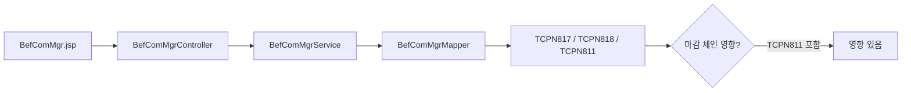

# Yearend Chain Tracer

화면·테이블·프로시저 중 어느 하나를 시작점으로 받아, 연말정산 전체 체인(코드 파일 + DB 객체 + 마감 상태)을
양방향으로 추적한다.

---

## 목적

연말정산은 **5 레이어**로 구성되어 있고(`yearend-domain-map` 참조), 한 지점을 수정했을 때
영향이 다른 레이어로 전파된다. 본 스킬은 시작점 하나만 받으면 **관련 파일 목록 + 관련 DB 객체 + 마감 상태 영향** 을 빠르게 산출해 사용자가 **실제 수정 범위**를 예측할 수 있게 돕는다.

---

## 사용 시점

다음 상황에 발동한다.

- "`BefComMgr` 화면 수정하는데, 영향 받는 DB 객체 알려줘."
- "`TCPN843` 컬럼 하나 추가하면 어디까지 영향 가?"
- "`P_CPN_YEA_CLOSE` 가 호출하는 전체 체인 그려줘."
- "'총급여 0원' 증상이 어느 단계에서 생길 수 있어?"

---

## 입력 인식 방식

사용자 입력에서 다음 패턴 순서로 시작점을 식별한다.

1. `TCPN\d{3}` 패턴 → **테이블** 시작점
2. `PKG_CPN_YEA`, `P_CPN_` 패턴 → **DB 프로시저/패키지** 시작점
3. Java 클래스명(`[A-Z][a-zA-Z]+(Controller|Service|Mgr|Lst)`) 또는 파일 경로 → **화면/코드** 시작점
4. 위 패턴이 안 잡히면 → **증상/자연어** 시작점. 사용자에게 "어떤 화면/테이블에서 관측되었나" 역질문.

추가로 **귀속연도(work_yy)**를 요구한다. 입력에 `2026`, `2025` 같은 4자리 연도가 있으면 그대로 사용. 없으면 사용자에게 확인한다. 연도가 정해져야 `PKG_CPN_YEA_{YY}_*` 객체 이름을 확정할 수 있다.

---

## 양방향 추적 절차

### 앞으로: 화면 → DB

1. 화면 Java 파일 위치 확인 (`src/main/java/com/hr/cpn/yjungsan/**/*Controller.java`).
2. Controller → Service → DAO → Mapper XML (`src/main/resources/mapper/com/hr/cpn/yjungsan/**/*.xml`) 추적.
3. Mapper 에서 쓰는 테이블 추출 (`FROM`, `JOIN`, `UPDATE`, `INSERT INTO`, `MERGE INTO`).
4. 추출된 테이블을 `yearend-domain-map` 에 넘겨 업데이트 주체 패키지 확보.
5. 화면이 **레거시 JSP 경로(`src/main/webapp/yjungsan/y_{YY}/`)** 로도 분기하는지 확인.

### 뒤로: DB → 화면

1. 테이블명으로 Mapper XML 전체 검색 (`grep -r "FROM TCPN\d{3}" src/main/resources/mapper/com/hr/cpn/yjungsan`).
2. Mapper ID 를 Java 에서 역추적 (`grep -r "getList.*mapperID"`).
3. Controller 엔트리 포인트(`@RequestMapping` 또는 `.do?cmd=`) 정리.
4. 동일 테이블을 **레거시 JSP** 도 쓰는지 확인 (`grep -r "TCPN\d{3}" src/main/webapp/yjungsan`).

### 마감 영향 판정

5. 추출된 테이블 집합이 `TCPN811`, `TCPN841`, `TCPN843`, `TCPN849` 중 하나를 포함하면 **마감 체인 영향 있음**으로 표시.
6. `references/yjungsan-close-chain.md` 를 추가 참조해 구체 체인 위치를 답변에 포함.

---

## ehr-harness 공통 스킬 위임 규칙

다음 스킬이 **같은 프로젝트의 `.claude/skills/` 또는 `~/.claude/skills/` 에 존재하면** 위임한다.

| 단계 | 위임 대상 | 미설치 시 대체 |
|---|---|---|
| Mapper XML 파싱 | `codebase-navigator` | `grep`/`rg` 로 수동 탐색 |
| 프로시저 호출 체인 | `procedure-tracer` | `yearend-domain-map` 의 `references/yjungsan-packages.md` |
| DB 실조회 (스키마 확인) | `db-query` | 생략 (사용자에게 "실DB 확인 필요" 플래그만 남김) |
| 영향도 집계 | `impact-analyzer` | 본 스킬 자체 집계 |

위임 가능 여부는 호출 시점에 `find ~/.claude/skills -name "SKILL.md"` + 현재 프로젝트 `.claude/skills/` 를 훑어서 확인한다.

---

## 출력 형식

항상 다음 5개 섹션으로 답한다.

1. **시작점** — 입력을 인식한 결과 (타입 + 이름 + 귀속연도).
2. **체인 다이어그램** — mermaid 블록 1개.
3. **코드 파일 목록** — 절대 또는 프로젝트 상대 경로.
4. **DB 객체 목록** — 테이블 + 패키지/프로시저 (읽기/쓰기 구분).
5. **마감 영향** — "영향 있음(이유)" / "영향 없음" 중 하나 + 근거.

### 예시 다이어그램 형태

