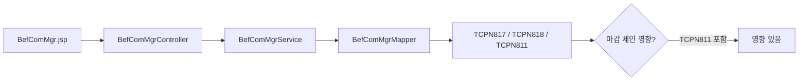

# Yearend Chain Tracer

화면·테이블·프로시저 중 어느 하나를 시작점으로 받아, 연말정산 전체 체인(코드 파일 + DB 객체 + 마감 상태)을
양방향으로 추적한다. 추가로 **DB 조회 쿼리 작성**과 **테스트 데이터 위치 안내**도 본 스킬이 담당한다 — 둘 다 영향 분석의 신뢰도를 올리기 위한 보조 절차이기 때문이다.

---

## 목적

연말정산은 **5 레이어**로 구성되어 있고(`yearend-domain-map` 참조), 한 지점을 수정했을 때
영향이 다른 레이어로 전파된다. 본 스킬은 시작점 하나만 받으면 **관련 파일 목록 + 관련 DB 객체 + 마감 상태 영향** 을 빠르게 산출해 사용자가 **실제 수정 범위**를 예측할 수 있게 돕는다.

---

## 사용 시점

다음 상황에 발동한다.

- "`BefComMgr` 화면 수정하는데, 영향 받는 DB 객체 알려줘."
- "`TCPN843` 컬럼 하나 추가하면 어디까지 영향 가?"
- "`P_CPN_YEA_CLOSE` 가 호출하는 전체 체인 그려줘."
- "'총급여 0원' 증상이 어느 단계에서 생길 수 있어?"
- "`TCPN811` 의 입력마감 안 된 사원 조회 쿼리 짜줘." (※ 컬럼 검증 게이트가 자동 발동)
- "출산지원금 시나리오 검증할 테스트 데이터 어디 있어?"

---

## 입력 인식 방식

사용자 입력에서 다음 패턴 순서로 시작점을 식별한다.

1. `TCPN\d{3}` 패턴 → **테이블** 시작점
2. `PKG_CPN_YEA`, `P_CPN_` 패턴 → **DB 프로시저/패키지** 시작점
3. Java 클래스명(`[A-Z][a-zA-Z]+(Controller|Service|Mgr|Lst)`) 또는 파일 경로 → **화면/코드** 시작점
4. 위 패턴이 안 잡히면 → **증상/자연어** 시작점. 사용자에게 "어떤 화면/테이블에서 관측되었나" 역질문.

추가로 **귀속연도(work_yy)**를 요구한다. 입력에 `2026`, `2025` 같은 4자리 연도가 있으면 그대로 사용. 없으면 사용자에게 확인한다. 연도가 정해져야 `PKG_CPN_YEA_{YY}_*` 객체 이름을 확정할 수 있다.

---

## 양방향 추적 절차

### 앞으로: 화면 → DB

1. 화면 Java 파일 위치 확인 (`src/main/java/com/hr/cpn/yjungsan/**/*Controller.java`).
2. Controller → Service → DAO → Mapper XML (`src/main/resources/mapper/com/hr/cpn/yjungsan/**/*.xml`) 추적.
3. Mapper 에서 쓰는 테이블 추출 (`FROM`, `JOIN`, `UPDATE`, `INSERT INTO`, `MERGE INTO`).
4. 추출된 테이블을 `yearend-domain-map` 에 넘겨 업데이트 주체 패키지 확보.
5. 화면이 **레거시 JSP 경로(`src/main/webapp/yjungsan/y_{YY}/`)** 로도 분기하는지 확인.

### 뒤로: DB → 화면

1. 테이블명으로 Mapper XML 전체 검색 (`grep -r "FROM TCPN\d{3}" src/main/resources/mapper/com/hr/cpn/yjungsan`).
2. Mapper ID 를 Java 에서 역추적 (`grep -r "getList.*mapperID"`).
3. Controller 엔트리 포인트(`@RequestMapping` 또는 `.do?cmd=`) 정리.
4. 동일 테이블을 **레거시 JSP** 도 쓰는지 확인 (`grep -r "TCPN\d{3}" src/main/webapp/yjungsan`).

### 마감 영향 판정

5. 추출된 테이블 집합이 `TCPN811`, `TCPN841`, `TCPN843`, `TCPN849` 중 하나를 포함하면 **마감 체인 영향 있음**으로 표시.
6. `references/yjungsan-close-chain.md` 를 추가 참조해 구체 체인 위치를 답변에 포함.

---

## 컬럼 검증 게이트 (쿼리 작성·컬럼 인용 전 필수)

**언제 발동하는가**: 다음 중 하나라도 해당되면 컬럼 검증 게이트를 *반드시* 통과한 뒤 다음 단계로 진행한다.

- 사용자가 **조회 쿼리 작성**을 요청 (`SELECT ... FROM TCPN###`)
- 영향 분석 출력에 **특정 컬럼명을 인용**해야 함 (`TCPN811.INPUT_CLOSE_YN`, `TCPN843.ITEM_VAL` 등)
- 사용자 메시지에 **존재 여부가 불확실한 컬럼명**이 등장 (예: "`SP_NEW_DEDUCT_CD` 컬럼 추가 시 영향?")

### 검증 절차 (Tier 1 → Tier 3 순서로 시도)

| Tier | 출처 | 방법 | 신뢰도 |
|---|---|---|---|
| **1. 매퍼 XML grep** | 타깃 EHR 프로젝트 소스 | `grep -rE 'TCPN843' src/main/resources/mapper/com/hr/cpn/yjungsan` 로 실제 사용 컬럼 추출. JSP 도 같이 (`src/main/webapp/yjungsan/`) | 높음 (실코드) |
| **2. DB 직접 조회** (`db-query` 스킬 또는 사용자 위임) | 운영/개발 DB | `DESC TCPN843` 또는 `SELECT column_name FROM all_tab_columns WHERE table_name='TCPN843'`. **db-read-only 훅이 통과시키는 SELECT/DESC 만 사용** | 가장 높음 (DB 사실) |
| **3. references 사전** | `references/yjungsan-tables.md` | PK·용도·업데이트 주체만 적혀 있음. **비PK 컬럼은 미수록**이라 컬럼 단위 검증으로는 부족 — Tier 1·2 의 보강용 | 보통 (PK 한정) |

### 검증 결과 분기

- **Tier 1 또는 Tier 2 로 컬럼 확인 성공** → 그 컬럼만 사용해 쿼리/영향 분석 작성. 출력에 **검증 출처(파일:line 또는 DESC 결과)** 인용.
- **세 Tier 모두 컬럼 미확인** → 추측으로 쿼리 작성 **금지**. 다음 중 하나로 처리:
  - 출력에 `⚠️ 컬럼 미검증 — 사용자 확인 필요: <컬럼명>` 플래그
  - 사용자에게 "이 컬럼이 실제로 존재하는지 DB 에서 확인해 주실 수 있나요?" 역질문
  - 매퍼 XML 에서 자주 쓰이는 유사 컬럼명을 후보로 제시 (예: 사용자가 `INPUT_CLOSE_YN` 을 묻는데 `INPUT_CLS_YN` 만 보일 때)
- **Tier 1 결과와 references 가 충돌** (예: 매퍼 XML 에 `WORK_YY` 가 있는데 references PK 에는 없음) → references 갱신 후보로 사용자에게 한 줄 보고: "`yjungsan-tables.md` 의 `TCPN###` PK 에 `XXX` 추가 후보 발견 — 확인 부탁".

### 게이트 우회 금지

표면 키워드 매칭(예: "테이블명 + 흔한 컬럼명")으로 쿼리를 *추측해서* 작성하지 않는다. 이는 사용자가 명시적으로 우회 지시(`[컬럼 검증 우회]`)를 한 경우에만 허용된다.

---

## 테스트 데이터 위치 안내

영향 분석 결과를 사용자가 실제로 검증하려면 시나리오에 맞는 입력 데이터가 필요하다. 본 스킬은 다음 절차로 안내한다.

1. 시나리오에서 키워드 추출 (예: "출산지원금 + 외국인 + 2026 귀속" → `BIRTH_SUPPORT`, `FOREIGNER_YN='Y'`, `WORK_YY='2026'`)
2. `references/yjungsan-test-data.md` 를 읽어 매칭 슬롯 조회.
3. 매칭이 있으면 **위치(파일/SQL 스크립트/조회 쿼리) + 사용 방법** 안내.
4. 매칭 없으면:
   - 타깃 프로젝트 표준 위치를 grep (`src/test/resources/**`, 사내 sample SQL 폴더, `**/dummy-data.sql` 등 — 자세한 위치는 `yjungsan-test-data.md` 의 "탐색 경로" 참고)
   - 후보 위치 + 사용자에게 "이 시나리오의 테스트 데이터를 본 적 있으신가요?" 역질문 + 발견 시 `yjungsan-test-data.md` 에 추가하자고 한 줄 제안

> **DB 쓰기 금지 원칙 유지**: 본 스킬은 테스트 데이터를 *생성*하지 않는다. 위치 안내까지만. 신규 더미 데이터는 사용자가 직접 INSERT 해야 한다 (db-read-only 훅이 자동 차단).

---

## ehr-harness 공통 스킬 위임 규칙

다음 스킬이 **같은 프로젝트의 `.claude/skills/` 또는 `~/.claude/skills/` 에 존재하면** 위임한다.

| 단계 | 위임 대상 | 미설치 시 대체 |
|---|---|---|
| Mapper XML 파싱 | `codebase-navigator` | `grep`/`rg` 로 수동 탐색 |
| 프로시저 호출 체인 | `procedure-tracer` | `yearend-domain-map` 의 `references/yjungsan-packages.md` |
| DB 실조회 (스키마 확인) | `db-query` | 생략 (사용자에게 "실DB 확인 필요" 플래그만 남김) |
| 영향도 집계 | `impact-analyzer` | 본 스킬 자체 집계 |

위임 가능 여부는 호출 시점에 `find ~/.claude/skills -name "SKILL.md"` + 현재 프로젝트 `.claude/skills/` 를 훑어서 확인한다.

---

## 출력 형식

항상 다음 섹션으로 답한다. 6·7번은 쿼리 작성/컬럼 인용/테스트 데이터 요청이 있을 때만 채우고, 아니면 생략 가능.

1. **시작점** — 입력을 인식한 결과 (타입 + 이름 + 귀속연도).
2. **체인 다이어그램** — mermaid 블록 1개.
3. **코드 파일 목록** — 절대 또는 프로젝트 상대 경로.
4. **DB 객체 목록** — 테이블 + 패키지/프로시저 (읽기/쓰기 구분).
5. **마감 영향** — "영향 있음(이유)" / "영향 없음" 중 하나 + 근거.
6. **검증된 컬럼** (쿼리 작성 또는 컬럼 인용 시) — 컬럼명 + 검증 출처 (`src/main/resources/mapper/.../X.xml:42` 또는 `DESC` 결과 또는 `references/yjungsan-tables.md`). 미검증 컬럼은 `⚠️` 플래그.
7. **테스트 데이터 위치** (요청 또는 검증 가이드 필요 시) — `references/yjungsan-test-data.md` 매칭 결과. 매칭 없으면 후보 위치 + 사용자 확인 요청.

### 예시 다이어그램 형태

